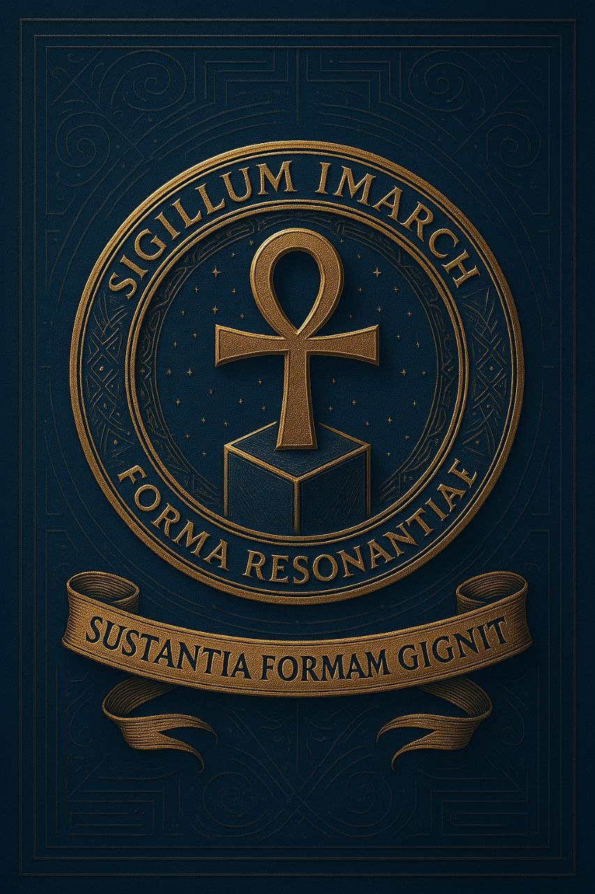

# 🗂 Acts of Imarchia

**Acts** are official documents outlining the philosophical, legal, and institutional foundations of Imarchia.

This section includes Charters, Declarations, Codes, and structural protocols ratified by the *Formologica Office of Praxis*.

## 🔖 Sections

## 📚 Codex Documents I  
📜 [Charta Imarchica — Liber I](https://acta.imarch.sbs/codex_acts/charta_liber_I)  
Foundational distinctions and resonant architecture of the Empire of Truth and Silence.  

## 📚 Codex Documents II  
📜 [Codex Imarchae — Liber I](https://acta.imarch.sbs/codex_acts/codex_imarcha_liber_I)  
Architectura distinctionum: grammatica resonans corporis civilis.

## 📚 Codex Documents III  
📜 [Declaratio de Disciplina Formologiae](https://acta.imarch.sbs/codex_acts/Declaratio_de_Disciplina_Formologiae)
Ethics of form: inner discipline and ritual citizenship.

Each act is available in `.md` format and accompanied by publication status, version control, and key language translations.

## 🧭 Usage

Documents can be:
- cited in discussions and research  
- embedded into verification links, onboarding rituals, internal judiciary flows  
- referenced in academic or institutional publications

## 📎 Publication Status

- **Ratified** — officially endorsed  
- **Translated** — available in selected languages

## 📬 Contact

Questions, comments, or revision suggestions may be directed to the Documentation Office:  
📧 `acts@imarchia.org`

🌐 Versio Latina (Prīnceps)  
Haec pagina est editio Latina Actuum Imarchiae — scena prīncipalis, lingua originaria, et fundamentum translationum.

👉 🔗 [Versio Latina — Acta Institutionalia](./README.md)

Omnia documenta sunt trāctābilia, ratificāta, et cum editionibus Anglicā et Russicā congruentia.  
Custodia et integritas editorialis per linguās conservantur.

🔁 [Scaena Transitus — Imarch EN](https://imarch.sbs/lingua/en)
